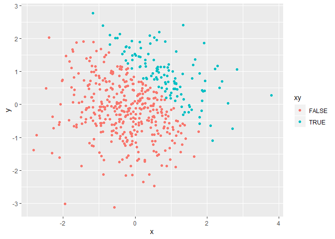
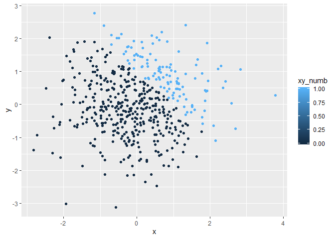
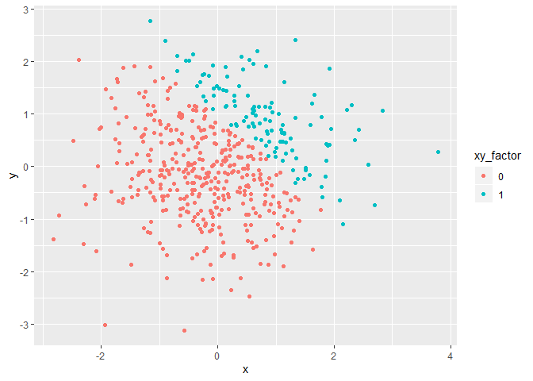

p8105\_hw1\_cg3112
================

Setup and Libraries
===================

Creating a dataframe (Problem 1)
--------------------------------

``` r
plot_df = tibble(
  a = rnorm(8),
  b = a > 0,
  c = ("EasyPeez"),
  e = factor(d,labels=c("I","II","III"))
)

plot_df
```

    ## # A tibble: 8 x 4
    ##         a b     c        e    
    ##     <dbl> <lgl> <chr>    <fct>
    ## 1  0.107  TRUE  EasyPeez I    
    ## 2 -2.28   FALSE EasyPeez II   
    ## 3 -0.859  FALSE EasyPeez III  
    ## 4  0.679  TRUE  EasyPeez I    
    ## 5  0.0690 TRUE  EasyPeez II   
    ## 6  0.653  TRUE  EasyPeez I    
    ## 7  1.01   TRUE  EasyPeez II   
    ## 8  0.0271 TRUE  EasyPeez III

``` r
mean(plot_df)
#This function does not work if the data is not numeric or logical

as.numeric(plot_df)
#This function does not work because list objects cannot be coerced into a double
```

Manipulating the Tibble and adding variables (End of Problem 1)
===============================================================

``` r
mutate(plot_df,
       b_numb = as.numeric(b),
       f_new = b_numb*a,
       b_fact = as.factor(b),
       g_new = b_fact*a,
       b_numb2 = as.numeric(b_fact),
       h_new = b_numb2*a
       )
```

    ## # A tibble: 8 x 10
    ##         a b     c        e     b_numb  f_new b_fact g_new b_numb2   h_new
    ##     <dbl> <lgl> <chr>    <fct>  <dbl>  <dbl> <fct>  <lgl>   <dbl>   <dbl>
    ## 1  0.107  TRUE  EasyPeez I          1 0.107  TRUE   NA          2  0.214 
    ## 2 -2.28   FALSE EasyPeez II         0 0      FALSE  NA          1 -2.28  
    ## 3 -0.859  FALSE EasyPeez III        0 0      FALSE  NA          1 -0.859 
    ## 4  0.679  TRUE  EasyPeez I          1 0.679  TRUE   NA          2  1.36  
    ## 5  0.0690 TRUE  EasyPeez II         1 0.0690 TRUE   NA          2  0.138 
    ## 6  0.653  TRUE  EasyPeez I          1 0.653  TRUE   NA          2  1.31  
    ## 7  1.01   TRUE  EasyPeez II         1 1.01   TRUE   NA          2  2.03  
    ## 8  0.0271 TRUE  EasyPeez III        1 0.0271 TRUE   NA          2  0.0542

Creating a data frame (Problem 2)
=================================

``` r
plot_df2 = tibble(
  x = rnorm(500),
  y = rnorm(500),
  xy = x + y > 1,
  xy_numb = as.numeric(xy),
  xy_factor = as.factor(xy_numb)
)
```

This tibble has 500 rows and 5 columns. The vector x also has a mean of -0.0015007, a median of -0.0198587, and a standard deviation of 0.96517. The proportion of cases where x + y &gt; 1 is 0.23.

Creating Scatterplots of the Tibble data (End of Problem 2)
===========================================================

``` r
#Plot 1 (logic)
 ggplot(data = plot_df2, mapping = aes(x, y, color = xy)) + geom_point()
```



``` r
#Plot 2 (numeric)
#Here, the scale is based off the number range from 0-1, but we only have a value of 0 or 1.
 ggplot(data = plot_df2, mapping = aes(x, y, color = xy_numb)) + geom_point()
```



``` r
#Plot 3 (factor)
#Here, the scale is based off of the factor, either 0 or 1, which is the same as the logic plot, but with numbers instead.
 ggplot(data = plot_df2, mapping = aes(x, y, color = xy_factor)) + geom_point()
```


